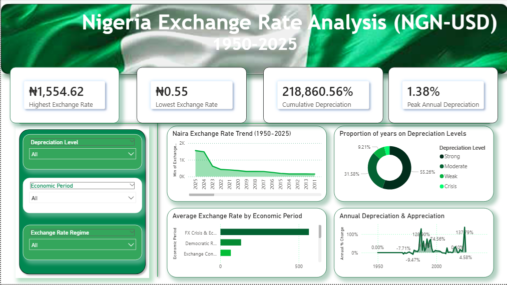

# Nigerian-Exchange-Rate-Analysis-1950-2025-
A Power BI dashboard analyzing 75 years of Nigeria's Naira to USD exchange rate, covering depreciation trends, economic periods, and exchange rate regimes from 1950-2025.

